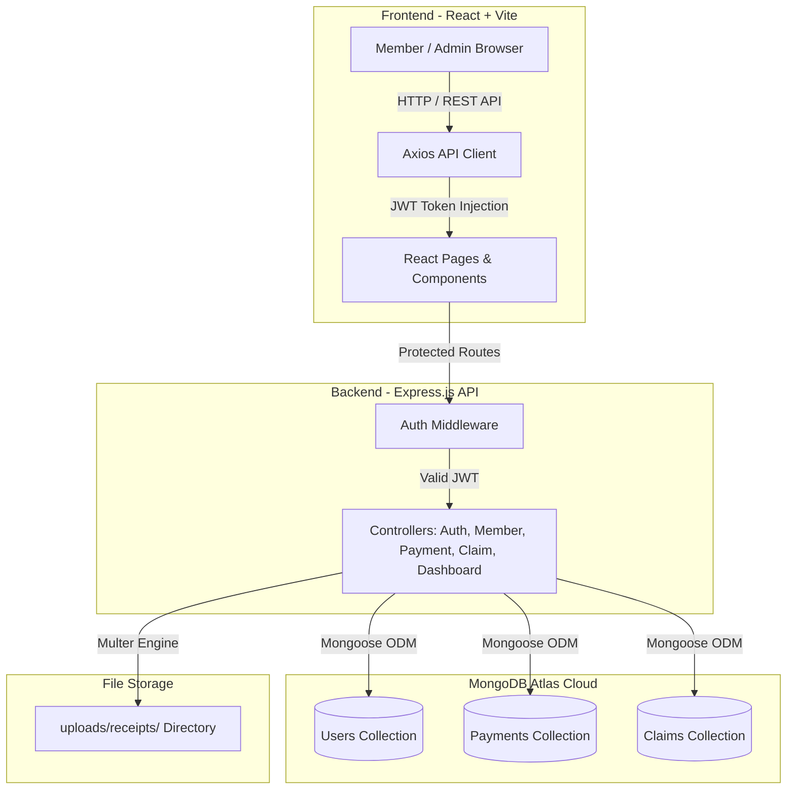

# 📘 EkamuthuERP (එකමුතු ERP)
> **Cloud-Based Community Mutual Aid & Death Donation Society Management System**  
> *මරණාධාර සමිති කළමනාකරණ ERP පද්ධතිය*


---

## 📌 Executive Summary (පද්ධති හැඳින්වීම)

**EkamuthuERP** යනු ග්‍රාමීය සහ ප්‍රජා මරණාධාර සමිති (*Community Mutual Aid Societies*) වල මූල්‍ය සහ සාමාජික කටයුතු සම්පූර්ණයෙන්ම ඩිජිටල්කරණය කිරීම සඳහා නිර්මාණය කරන ලද නවීන Enterprise Resource Planning (ERP) පද්ධතියකි.

මෙම පද්ධතිය මගින් සමිතියේ සාමාජිකයන් ලියාපදිංචි කිරීම, මාසික ග්‍රාහක මුදල් (Subscriptions) එකතු කිරීම, ප්‍රමාද ගාස්තු (Late Fines) ස්වයංක්‍රීයව ගණනය කිරීම, සාමාජිකයන් විසින් Bank Slips upload කිරීම, ලෙජර් වාර්තා සහ PDF Receipt ක්ෂණිකව නිර්මාණය කිරීම, සහ මරණාධාර හිමිකම් (Death Benefit Claims) කළමනාකරණය කිරීම ඉතා පහසුවෙන් සිදු කළ හැක.

---

## 🌟 Key Features & Modules (ප්‍රධාන විශේෂාංග)

### 1. 👥 Member Management & Role-Based Access (සාමාජික කළමනාකරණය)
- සාමාජිකයන්ගේ සම්පූර්ණ තොරතුරු, NIC, දුරකථන අංක, ලිපින සහ යැපෙන්නන්ගේ (Dependents) විස්තර පවත්වාගෙන යාම.
- **Role System**:
  - 👑 **Admin**: සම්පූර්ණ පද්ධති පාලනය, සාමාජිකයන් එකතු කිරීම/සංස්කරණය සහ ගෙවීම් අනුමත කිරීම.
  - 💰 **Treasurer (භාණ්ඩාගාරික)**: ගෙවීම් පටිගත කිරීම, Bank Slips අනුමත කිරීම සහ PDF Reports ලබාගැනීම.
  - 👤 **Member**: තමන්ගේ මාසික හිඟ මුදල් බැලීම, බැංකු රිසිට්පත් Upload කිරීම සහ මරණාධාර ඉල්ලුම් කිරීම.

### 2. 💳 Subscription & Automated Fine Engine (මාසික මුදල් & ප්‍රමාද ගාස්තු)
- මාසික සාමාජික ගාස්තුව ස්වයංක්‍රීයව පද්ධතිය මගින් ගණනය කිරීම.
- **Auto Late Fine Calculation**: නියමිත දිනට පසුව ගෙවන සෑම මාසයක් සඳහාම රු. 100/- ක ප්‍රමාද ගාස්තුවක් ස්වයංක්‍රීයව එකතු වීම.
- Multi-Month Bulk Selection: එකවර මාස කිහිපයක මුදල් ගෙවීමට ඇති පහසුකම.

### 3. 📑 Slip Upload & Self-Service Portal (සාමාජික ස්වයං-සේවා)
- සාමාජිකයන්ට තමන්ගේ ගෙවීම් රිසිට්පත් (Bank Payment Slips) කෙලින්ම Upload කිරීමේ පහසුකම.
- Admin / Treasurer හට Slip එක පරීක්ෂා කර **Approve** හෝ **Reject** කිරීමේ හැකියාව.

### 4. 📊 Real-Time Analytics Dashboard (තත්‍ය කාලීන විශ්ලේෂණ පුවරුව)
- මාසික ආදායම් වර්ධනය පෙන්වන **Interactive Bar Charts & Pie Charts** (Recharts).
- මුළු සාමාජිකයන් ගණන, මාසික එකතු කිරීම්, සහ අනුමැතියට ඇති Slips ගණන Live Metrics ලෙස ප්‍රදර්ශනය වීම.

### 5. ⚖️ Death Benefit Claim Workflow (මරණාධාර හිමිකම් කළමනාකරණය)
- සමිති සාමාජිකයෙකුගේ හෝ යැපෙන්නෙකුගේ අභාවයකදී මරණාධාර හිමිකම් පද්ධතිය හරහා Submit කිරීම.
- `Pending` ➔ `Approved` ➔ `Paid` Workflow එක හරහා විනිවිදභාවයෙන් යුතුව මුදල් නිදහස් කිරීම.

### 6. 📄 Automated PDF Receipt & Financial Reports (PDF වාර්තා)
- සෑම ගෙවීමක් සඳහාම **Printable PDF Receipt** එකක් ක්ෂණිකව Download කරගැනීම.
- මුළු සමිතියේම මූල්‍ය තත්ත්වය දැක්වෙන **Financial Summary PDF Reports** (`jsPDF` & `AutoTable` මගින්) export කිරීම.

---

## 🛠️ Technology Stack (තාක්ෂණික පදනම)

| Component | Technology | Description |
| :--- | :--- | :--- |
| **Frontend** | React 19 + Vite 8 | Single Page Application (SPA) with lightning fast rendering |
| **Styling** | Tailwind CSS v4 | Modern, responsive design system & UI components |
| **Backend API** | Node.js + Express 5 | High-performance RESTful API service |
| **Database** | MongoDB Atlas Cloud | Scalable NoSQL cloud database with Mongoose ODM |
| **Authentication**| JWT + Bcrypt | Secure token-based auth with salted password hashing |
| **File Storage** | Multer | Local physical storage for payment slip verification |
| **Reporting** | jsPDF & Recharts | PDF receipt rendering & dynamic financial graphs |

---

## 🏗️ System Architecture & Workflow



---

## 🚀 Quick Start & Installation Guide

### 📋 Prerequisites
- **Node.js** (v18.0.0 or higher)
- **Git**
- **MongoDB Atlas** database URI (or local MongoDB server)

---

### 1. Repository එක Clone කරගන්න (Clone Repository)
```bash
git clone https://github.com/Shamikakkss/ekamuthu-erp.git
cd ekamuthu-erp
```

---

### 2. Backend Server එක සකස් කිරීම (Setup Backend)
```bash
# Navigate to backend directory
cd backend

# Install dependencies
npm install

# Create .env file inside backend folder
cat <<EOT > .env
PORT=5000
MONGO_URI=your_mongodb_atlas_connection_string
JWT_SECRET=your_super_secret_jwt_key
EOT

# Start the Backend Server (runs on http://localhost:5000)
npm run dev
```

---

### 3. Frontend Application එක සකස් කිරීම (Setup Frontend)
```bash
# Open a new terminal tab and navigate to frontend directory
cd frontend

# Install dependencies
npm install

# Start Vite Development Server (runs on http://localhost:5173)
npm run dev
```

---

## 📡 API Endpoint Overview

| Method | Endpoint | Description | Access |
| :--- | :--- | :--- | :--- |
| `POST` | `/api/auth/register` | Register new member/admin | Public / Admin |
| `POST` | `/api/auth/login` | Authenticate user & get JWT token | Public |
| `GET` | `/api/members` | Get list of registered members | Admin / Treasurer |
| `GET` | `/api/members/profile` | Get logged-in user profile details | Protected |
| `GET` | `/api/payments` | Get payment history | Protected |
| `POST` | `/api/payments` | Record subscription & fine payment | Admin / Treasurer |
| `POST` | `/api/payments/member-pay` | Submit payment with slip attachment | Member |
| `PUT` | `/api/payments/:id/status` | Approve or Reject payment slip | Admin / Treasurer |
| `GET` | `/api/dashboard/stats` | Fetch aggregated financial stats & charts | Protected |
| `POST` | `/api/claims` | Submit a death benefit claim | Protected |
| `PUT` | `/api/claims/:id/status` | Approve/Reject/Pay benefit claim | Admin |

---

## 📂 Repository Structure

```
ekamuthu-erp/
├── backend/                  # Node.js Express Server
│   ├── config/               # Database connection (db.js with DNS fallback)
│   ├── controllers/          # Business logic (Auth, Member, Payment, Claim, Dashboard)
│   ├── middleware/           # Security & JWT verification (authMiddleware.js)
│   ├── models/               # Database schemas (User.js, Payment.js, Claim.js)
│   ├── routes/               # Express API routing definitions
│   └── uploads/receipts/     # Payment slip physical files
├── frontend/                 # React SPA (Vite)
│   ├── src/
│   │   ├── components/       # Reusable UI components & modals
│   │   ├── pages/            # Login, Dashboard, Members, Payments, Claims
│   │   ├── utils/            # generatePDF.js (jsPDF receipts & report generator)
│   │   ├── api.js            # Axios client with automatic bearer token header
│   │   └── App.jsx           # App layout & Protected Routes logic
├── IMPLEMENTATION_PLAN.md    # Development Roadmap & Technical specifications
├── PROJECT_DOCUMENTATION.md  # Detailed developer technical reference
└── README.md                 # Main GitHub repository landing documentation
```

---

## 🤝 Contributing & License

Developed with ❤️ for **Ekamuthu Community Mutual Aid Society (*එකමුතු මරණාධාර සමිතිය*)**.  
This project is licensed under the **MIT License**.

---
*Created by [Shamikakkss](https://github.com/Shamikakkss) • Built for real-world community impact.* 🚀
